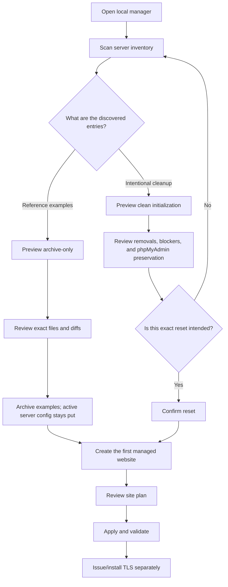
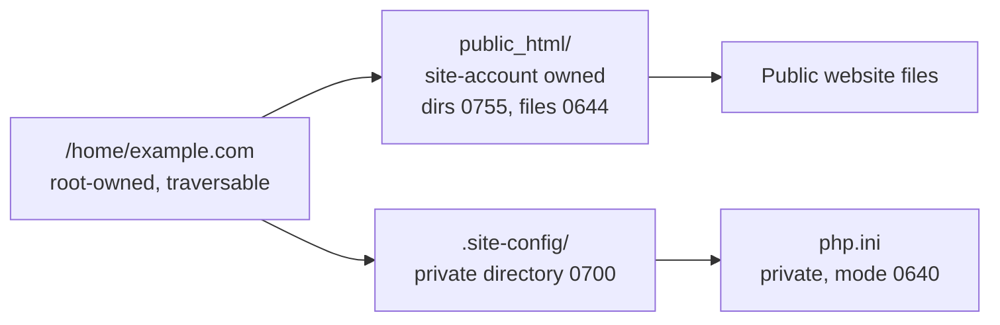
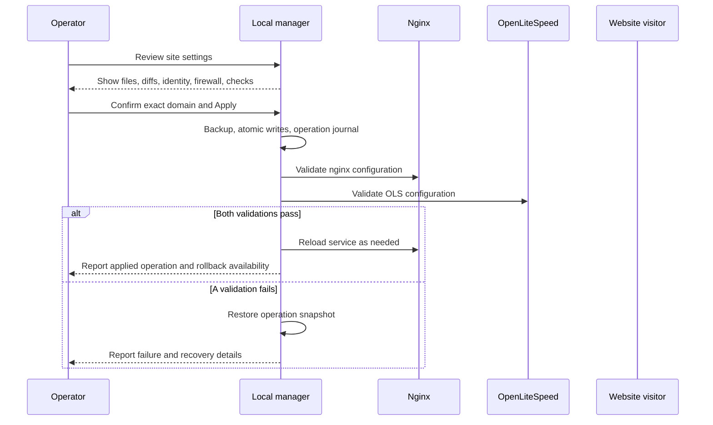
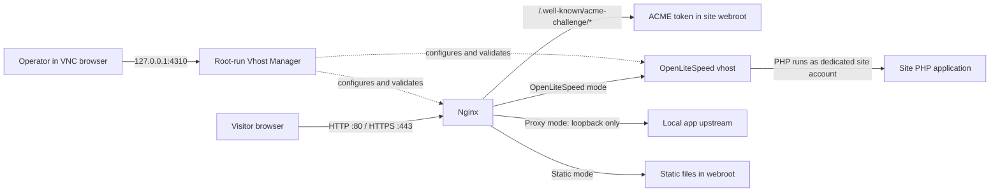

# Local Vhost Manager user manual

This guide explains how to initialize the local Vhost Manager, create and edit a website, choose settings, and safely apply changes. The manager runs with root privileges because it writes web server configuration, creates site accounts, and can update the host firewall. Every operation has a review step before it changes the server.

## 1. Start the manager

Use the **Vhost Manager** launcher on the left XFCE panel. It starts the manager service and opens the VNC browser at `http://127.0.0.1:4310`.

This desktop's left application panel can auto-hide. If it is not visible, move the pointer to the left screen edge; the Vhost Manager launcher is in that panel's app launcher stack.

If the launcher is unavailable, open a terminal in the repository and run:

```bash
nvm use 24.21.0
npm run vhost:build
sudo npm run vhost:start
```

Then open `http://127.0.0.1:4310` in the server's local browser. The manager listens on loopback (`127.0.0.1`) and is intended for the local VNC session. Do not publish this address through a public reverse proxy.

The interface starts in dark mode with 175% text scaling, or 200% when the browser detects a 4K UHD display from the screen dimensions and pixel ratio. The text-size toolbar shows the current percentage and a **4K UHD** badge when detected. Use **A− / A+** to adjust text; your manual choice persists in the browser. Small labels have a 12-pixel minimum before scaling. Text wraps within the normal page layout instead of zooming the whole page. On screens under 420 CSS pixels wide, the toolbar hides its text labels to preserve room, while keeping the size buttons and percentage visible.

## 2. Understand the first-run inventory

The sidebar is an inventory of configuration files found on the server. An entry can be a managed site, an unenabled config, a broken link, or a reference example. An inventory entry does not mean the site has been provisioned or is intended to go live.

Start with **Scan inventory**. Review each site's state and the health notices. Open an entry to see its files, enabled state, and detected issues. External changes are rescanned from the server's configuration; the manager manifest stores manager metadata and operation history, while Nginx and OpenLiteSpeed configuration files remain the source of truth for server behavior.

On this host, the inventory has reported dangling links under `/etc/nginx/sites-enabled/` (including `default`, `eaglesvn.club`, and `obgyn.eaglesvn.club`) and a stale OpenLiteSpeed reference to `eaglesvn.club`. These are configuration artifacts to inspect; they do not represent websites to provision. The archive-only action preserves examples but does not repair invalid active configuration. Before applying site changes, resolve each blocker named by the live validation preview and rescan.

### Preserve example configurations

If the discovered entries are examples, choose **Save examples to archive only** from the initialization/reset workflow. Review the preview and exact file list first. This creates a root-owned snapshot under the manager backup directory and leaves active configurations unchanged. You can then create real sites without treating the examples as websites to adopt.

Choose the separately confirmed **clean initialization/reset** only when you intend to remove the listed non-phpMyAdmin site configurations from active Nginx and OpenLiteSpeed paths. Read the complete file list and diffs before confirming. The manager snapshots files before applying the reset and validates Nginx and OpenLiteSpeed before reload. phpMyAdmin's OLS vhost, listener mapping, credentials, and `/opt/phpmyadmin` application files are preserved. Global settings, ACME data, and website data are outside the reset scope.

The preview may report broken Nginx links or stale OpenLiteSpeed references. Treat these as blockers to understand and resolve before applying. Do not confirm a reset just to make the warning disappear; inspect the listed target and the proposed change first.



## 3. Create a website: step by step

Select **Create new website** (or **Create the first website**) and complete the form. The primary domain is required. Select **Review plan** to see the proposed files, ownership, firewall rules, and validation steps. Inspect this plan before pressing **Apply**.

### Step 1: Identify the site

| Field           | What to enter                                             | Recommended choice                                                                                                            |
| --------------- | --------------------------------------------------------- | ----------------------------------------------------------------------------------------------------------------------------- |
| **Domain name** | The primary fully qualified domain, such as `example.com` | Use the exact canonical domain you control. DNS must point to this server before public certificate issuance.                 |
| **Aliases**     | Other hostnames, separated by commas or spaces            | Add `www.example.com` only if DNS and the certificate will cover it. Add no alias you do not control.                         |
| **Site label**  | A readable name for the sidebar                           | Use the project or service name. This is display metadata.                                                                    |
| **Webroot**     | Public document directory                                 | Keep `/home/<domain>/public_html/` unless the application has a clear reason to use another directory under that site's home. |
| **Notes**       | Optional operator notes                                   | Record purpose, environment, or owner contact; do not put passwords or private keys here.                                     |

### Optional MySQL/MariaDB database

For a new site, enable **Create a MySQL/MariaDB database** and review the database and username. The manager checks that both are unused, creates a `utf8mb4` database, and grants a new `localhost`-only user access only to that database. The manager must be able to authenticate to the local server as root over its Unix socket; it does not accept remote database hosts or existing database credentials.

The manager generates a random password during preview, keeps it only in the expiring server-side plan, and displays it once after successful apply. Save it with your application configuration at that point. It is not written to the site manifest, operation history, diffs, or logs. If site configuration is later rolled back, the database is deliberately preserved so rollback cannot destroy application data.

Each site gets a dedicated no-login Unix account and its own private primary group. The account name is generated from the first four characters of the domain, the full domain slug, and the current month and year (`MMYY`), subject to Linux's 32-character account-name limit. OpenLiteSpeed runs the site's PHP processes as that account. The manager displays the exact account in the review plan. Do not select or reuse the `eaglesvn` account as a site owner.

The dedicated account isolates file ownership and PHP process identity; it does not impose a disk, CPU, or memory quota by itself. The current manager has no quota setting. If you need storage caps, configure and verify Linux filesystem user quotas separately on a filesystem and mount that support them.

### Step 2: Choose files and permissions

| Setting                   | Recommended starting point                    | Choose another value when…                                                                                                                                                                                                                                 |
| ------------------------- | --------------------------------------------- | ---------------------------------------------------------------------------------------------------------------------------------------------------------------------------------------------------------------------------------------------------------- |
| **Directory permissions** | `0755`                                        | `0750`/`0770` are appropriate only after confirming the Nginx and OLS service accounts can traverse the path. `0775`/`0770` grant group write access; use only when the group membership and deployment workflow are deliberately configured.              |
| **File permissions**      | `0644`                                        | `0640`/`0660` restrict reads and can prevent the web server from serving files unless its access is configured. `0664`/`0660` allow group writes; choose only for an intentional shared editing workflow.                                                  |
| **Placeholder page**      | On for a new, empty site                      | Turn off when you already have content in the webroot or will deploy it immediately.                                                                                                                                                                       |
| **robots.txt**            | Allow indexing for a public production site   | Choose **Block crawling during setup** for a temporary/staging site. `robots.txt` is a crawler hint, not access control; use authentication or network controls for private content. Choose **Do not create** if your application manages the file itself. |
| **OLS `.htaccess`**       | Off until the application needs rewrite rules | Turn on only for OpenLiteSpeed mode when the application requires `.htaccess` rewrites. Nginx and static modes do not use this file.                                                                                                                       |

For a standard public site, `0755` directories and `0644` files are the most compatible defaults. The site account owns the webroot; the manager's private PHP configuration sits outside the public webroot.



### Step 3: Choose routing and ports

| Request mode                              | Use it for                                           | What the manager prepares                                                                                                                                              |
| ----------------------------------------- | ---------------------------------------------------- | ---------------------------------------------------------------------------------------------------------------------------------------------------------------------- |
| **OpenLiteSpeed managed vhost** (default) | PHP applications and sites using OLS vhost behavior  | Nginx front end, OLS vhost, dedicated PHP identity, selected PHP handler/profile, and private per-site PHP ini.                                                        |
| **Proxy to a local upstream**             | An application already listening on this same server | Nginx proxy to a loopback address and port, such as `127.0.0.1:3000`. Only loopback upstreams are accepted. The application port is not opened to the public firewall. |
| **Static files served by Nginx**          | HTML, CSS, JS, images, or other static content       | Nginx serves the site directly; no OLS vhost or per-site PHP configuration is created.                                                                                 |

Choose **OpenLiteSpeed** unless the application is already a local service or is fully static. For a proxy site, enter the app's listening port in **Upstream host and port**; do not add it to the firewall fields.

**TCP ports** and **UDP ports** are inbound firewall openings. New sites default to TCP `80, 443`; UDP is empty. The reviewed operation adds rules for IPv4 and IPv6 and persists them with iptables-persistent. Rules allow all source addresses. Keep only ports the public service needs. Most websites need TCP 80 and 443; do not add UDP 443 unless you have deliberately configured HTTP/3/QUIC. Do not enter an upstream application port here. The site preview must show the ports you expect before applying.

### Step 4: Set PHP values (OpenLiteSpeed mode only)

The PHP section appears for OpenLiteSpeed mode. Choose an installed PHP handler and ini profile. The simple controls are prefilled from that profile; advanced directives let you add `directive = value` lines. The generated site ini uses the selected profile as its base and applies only to this site.

Recommended approach:

1. Keep the detected handler and profile for the first deployment unless you know the application requires another version.
2. Keep existing memory, upload, post, execution, input, variable, and timezone values unless the application has a measured need to change them.
3. If uploads are required, set **Post max size** at least as high as **Upload max filesize**, with enough room for request overhead.
4. Keep **Display errors** off on a public production site. Keep **Log errors** on so errors can be investigated without exposing details to visitors.
5. Use advanced directives for a specific documented requirement; keep one directive per line and review the generated ini in the plan.

These values do not alter the shared PHP ini. If a field says **Not set in profile**, leaving it empty preserves the profile's behavior.

### Step 5: Select TLS and Nginx settings

The manager prepares the ACME challenge config at `/etc/nginx/sites-available/vhost_ssl/<domain>_ssl.conf` and enables it through `/etc/nginx/sites-enabled/<domain>_ssl.conf`. It also prepares the production config at `/etc/nginx/sites-available/<domain>.conf`. Production TLS is staged separately; the manager does not activate it until certificate and private key files exist.

| Setting                           | Recommended choice                                                                                                                                                                                                                            |
| --------------------------------- | --------------------------------------------------------------------------------------------------------------------------------------------------------------------------------------------------------------------------------------------- |
| **Redirect HTTP to HTTPS**        | Leave on for the intended production behavior. Before the certificate is installed and TLS config is activated, use the challenge config for HTTP-01 issuance; the redirect option does not make a missing certificate appear.                |
| **Certificate/private key paths** | Keep the proposed ACME paths unless your ACME client stores files elsewhere. Confirm the files actually exist at those paths before activating the production TLS config. Keep the private key readable only by the services that require it. |
| **Nginx access/error logs**       | Keep the per-site defaults unless your log rotation or monitoring setup requires another valid path.                                                                                                                                          |
| **OLS listener**                  | Keep **Default** unless the site must attach to a specific existing listener. Do not change phpMyAdmin's listener mapping while configuring another site.                                                                                     |

The first site apply does not issue a certificate. After DNS is correct, complete certificate issuance with the ACME workflow, verify the certificate and key paths, then review and activate the production TLS configuration as a separate operation. Do not enable a production config that points to absent or mismatched certificate files.

### Step 6: Choose security, CSP, MIME, and cache settings

| Setting                         | Recommended starting point                                                                                      | Guidance                                                                                                                                                                                                                                                                                                                                                                                           |
| ------------------------------- | --------------------------------------------------------------------------------------------------------------- | -------------------------------------------------------------------------------------------------------------------------------------------------------------------------------------------------------------------------------------------------------------------------------------------------------------------------------------------------------------------------------------------------- |
| **CSP source**                  | **Global default policy**                                                                                       | The shared policy includes the Eagles, GPTpatient, and EaglesVN domain families; Google Analytics/Tag Manager; GPTMD Supabase and OpenAI API sources; and requested ACB Bank and IcePanel endpoints. It omits vendors marked unused, including Fonts/Translate APIs, Brevo, jsDelivr, unpkg, AMP, YouTube, and hCaptcha. The policy source is maintained at `vhost-manager/shared/csp-policy.txt`. |
| **CSP delivery mode**           | **Report only** at first                                                                                        | The browser reports violations while allowing the page to load. Check browser developer tools while exercising the site. Switch to **Enforce policy** after required resources work. Use **Off** only for diagnosis or a documented app requirement.                                                                                                                                               |
| **Custom CSP**                  | Choose only when this site needs a different policy                                                             | It starts with the global directive set. Add only the exact origins/directives required by the application, then test every workflow in report-only mode before enforcement.                                                                                                                                                                                                                       |
| **HSTS with includeSubDomains** | The form currently preselects this. Turn it off until HTTPS works for this domain and every affected subdomain. | HSTS can make browsers insist on HTTPS for the domain and its subdomains. Enable it only when the whole scope is ready.                                                                                                                                                                                                                                                                            |
| **Frame protection**            | `SAMEORIGIN`                                                                                                    | Choose `DENY` if the site must never be embedded, including by itself.                                                                                                                                                                                                                                                                                                                             |
| **Referrer policy**             | `strict-origin`                                                                                                 | This limits referrer details sent to other sites. Use a stricter option only if the application needs it.                                                                                                                                                                                                                                                                                          |
| **Permissions policy**          | Keep geolocation, microphone, and camera disabled                                                               | Add a capability only when the site uses it and the feature is intentionally exposed.                                                                                                                                                                                                                                                                                                              |
| **Additional MIME mappings**    | Empty                                                                                                           | Add mappings only when a file type must be served with a specific MIME type. The system `mime.types` map is retained. Use `type extension` on each line.                                                                                                                                                                                                                                           |
| **Static asset browser cache**  | `1h`                                                                                                            | `5m` is useful during frequent deployments; `30d` suits versioned assets that change filenames when content changes. Set **Off** when assets are updated in place and must appear immediately.                                                                                                                                                                                                     |
| **Shared Nginx proxy cache**    | Off                                                                                                             | Enable only if the host reports a configured shared `cache_zone` and the application is safe to cache. Authorization and cookie requests bypass this cache, but verify application behavior before opting in.                                                                                                                                                                                      |

The global CSP is intentionally broad enough for the currently requested first-party and vendor integrations. It is still a starting policy: a site that uses a new service may need a narrowly scoped custom policy. Do not add an origin merely to suppress a console message without confirming the site uses that service.

### Step 7: Review the plan and apply

Before applying, verify the preview includes:

- The intended domain, aliases, webroot, and request mode.
- The generated dedicated account and group.
- The expected ownership and permission changes.
- Only the TCP/UDP ports you want open to all sources.
- The intended Nginx and OLS files for the selected request mode.
- The PHP handler/profile and private ini values, when using OLS.
- CSP/security/cache values and the expected certificate paths.
- The exact validation actions and any blockers.

If anything is unexpected, return to the form and change it before applying. Apply requires the domain confirmation shown by the manager. The operation takes a root-owned backup, writes configuration atomically, validates Nginx and OpenLiteSpeed, and reloads only after validation succeeds. The operation appears in **Recent activity / History** and eligible changes can be rolled back from their operation details.



## 4. How requests reach the site

The manager's browser UI is a local administration path. Public website traffic follows Nginx and then the selected site mode.



## 5. Edit, enable, disable, adopt, and roll back

- **Edit:** Select a managed site, choose **Edit**, change the settings, and review a new plan. Existing site identity is retained.
- **Enable/disable challenge config:** The sidebar action controls the ACME challenge Nginx config. Use it when the reviewed plan calls for the HTTP challenge path; it is not a substitute for activating the production HTTPS config.
- **Adopt:** Adoption records a discovered config as manager metadata. Review its preview carefully; use it only when the config is a real site you want the manager to track. Keep example configs archived instead.
- **History:** Open **Recent activity** or **View all** to inspect operation results, backups, and rollback availability.
- **Rollback:** Select a reversible operation from history and review the rollback action. Rollback restores the operation snapshot; it does not undo unrelated manual changes made afterward. Rescan and review current configuration before using it.
- **Rescan:** Scan after manual server changes so the sidebar reflects current files and link health.

## 6. Common setup recommendations

| Site situation            | Good initial choices                                                                                                                                                                                                                    |
| ------------------------- | --------------------------------------------------------------------------------------------------------------------------------------------------------------------------------------------------------------------------------------- |
| New public PHP site       | OLS mode; dedicated account; `/home/<domain>/public_html/`; directories `0755`, files `0644`; TCP 80/443; global CSP in report-only; PHP profile prefilled; placeholder on until deployment; robots allow only when ready for indexing. |
| Public static site        | Static mode; dedicated webroot and standard read permissions; TCP 80/443; global CSP report-only; browser cache `1h` or `30d` for fingerprinted assets.                                                                                 |
| Local Node/Python service | Proxy mode to its loopback listener; open only TCP 80/443 publicly; do not expose the app's internal port.                                                                                                                              |
| Staging site              | Keep it out of search with robots block, but protect it with real authentication or network access controls; report-only CSP; short asset cache; do not enable HSTS until HTTPS and all subdomains are ready.                           |
| Site with an unknown CSP  | Global CSP in report-only; exercise login, forms, uploads, analytics, and all major app screens; inspect browser console; add only necessary sources; then enforce.                                                                     |

## 7. Troubleshooting

| Message or symptom                                 | What to do                                                                                                                                                                                 |
| -------------------------------------------------- | ------------------------------------------------------------------------------------------------------------------------------------------------------------------------------------------ |
| Manager reports Nginx or OLS invalid               | Read the health message and reviewed plan. Fix the exact missing file, broken link, or stale reference it names, then rescan. Do not apply a plan while its validation blocker remains.    |
| A site appears in the sidebar but is not live      | Check whether its config is enabled, DNS points here, ports are reachable, and the site is managed or merely discovered. Inventory is not proof of public service.                         |
| Browser shows a certificate error                  | Confirm DNS, certificate issuance, certificate/key path and matching pair, then review production TLS activation. The initial site operation does not issue certificates.                  |
| PHP file downloads or returns an error             | Confirm OLS mode, selected handler, listener mapping, account identity, and site logs. Proxy/static modes intentionally do not create the OLS/PHP files.                                   |
| Browser reports CSP violations                     | Keep report-only while testing. Identify the blocked resource and whether the app actually needs it, then make a custom policy or update the shared policy through a reviewed code change. |
| Static files return 403                            | Check all parent directory traversal permissions as well as file readability for the Nginx service account. A `0750`/`0640` choice can block Nginx if group/ACL access is absent.          |
| Apply says the configuration changed since preview | Rescan and create a fresh preview. The manager deliberately avoids applying a stale plan.                                                                                                  |

## 8. Useful repository references

- Generated config templates: [`vhost-manager/boilerplate/README.md`](../vhost-manager/boilerplate/README.md)
- Current global CSP source: [`vhost-manager/shared/csp-policy.txt`](../vhost-manager/shared/csp-policy.txt)
- UI requirements and background: [`gui for data in put.md`](gui%20for%20data%20in%20put.md)
- Main project instructions: [`readme.md`](../readme.md)
